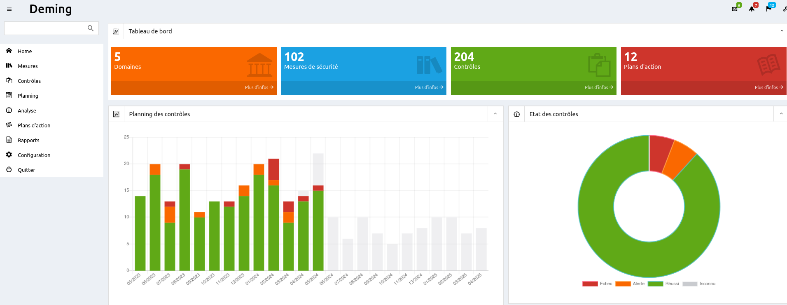
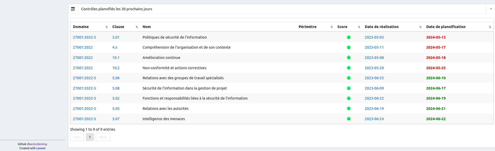
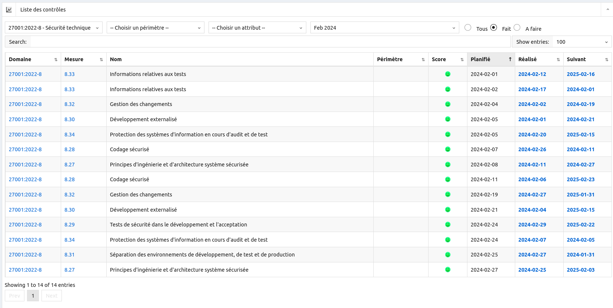

# Deming

## :rocket: Introduction

Dans un monde où la sécurité de l'information est plus critique que jamais, les organisations doivent non seulement implémenter des mesures de sécurité, mais aussi s'assurer que celles-ci sont effectives et performantes. **Deming** est là pour vous aider à relever ce défi avec brio.

### :question: Qu’est-ce que Deming ?

**Deming** est un outil puissant et intuitif conçu pour la gestion, la planification, le suivi et le reporting de l’efficacité des mesures de sécurité. Conformément à la norme ISO/IEC 27001:2013, chapitre 9, **Deming** vous aide à garantir une sécurité adaptée et proportionnée, tout en respectant les standards les plus exigeants.

### :dart: Pourquoi contrôler ?

Le contrôle et l'évaluation réguliers des mesures de sécurité sont essentiels pour :

- Évaluer l'efficacité des contrôles mis en place.
- Vérifier que les exigences de sécurité sont respectées.
- Améliorer continuellement la sécurité de l’information.
- Fournir des données précises pour les prises de décision.
- Justifier les besoins d'amélioration du système de gestion de la sécurité de l'information (SMSI).

**Deming** vous offre les outils nécessaires pour répondre à ces objectifs avec efficacité.

### :chart_with_upwards_trend: Évaluation des performances

Selon la norme ISO 27001, chapitre 9.1, il est impératif d'évaluer les performances de sécurité. **Deming** vous guide à travers ce processus en vous permettant de :

- Déterminer ce qui doit être surveillé et mesuré.
- Choisir les méthodes adéquates pour assurer la validité des résultats.
- Planifier les moments de surveillance et de mesure.
- Identifier les responsables de chaque tâche.
- Analyser et évaluer les résultats obtenus.

## :mag: Définitions clés

- **Mesures de sécurité** (Control) : Ensemble des dispositions mises en œuvre pour garantir la sécurité selon la politique définie.
- **Contrôle** (Measurement) : Processus d'évaluation de l'efficacité d'un SMSI via des méthodes et critères spécifiques.
- **Indicateur** : Résultat d'une analyse appliquée aux mesures de sécurité.
- **Attribut** : Propriété d'un objet mesurable quantitativement ou qualitativement.

## :computer: Aperçu des écrans

### :star: Écran principal

### :white_check_mark: Liste des contrôles

### :calendar: Planification des contrôles

### :memo: Gestion des plans d'action

### :satellite: Vue de la couverture des mesures de protection

### :page_facing_up: Rapport de réunion de pilotage du SMSI

## :books: Documentation

Pour en savoir plus sur l'utilisation de l'application, consultez la [documentation utilisateur](https://dbarzin.github.io/deming/index.fr/).

## :hammer_and_wrench: Technologies utilisées

- **Langages** : PHP, JavaScript
- **Framework** : Laravel
- **Base de données** : MySQL, PostgreSQL, SQLite, SQL Server
- **Graphiques** : ChartJS

## ⚙️ Installation

Suivez la [procédure d'installation pour Ubuntu](https://github.com/dbarzin/deming/blob/main/INSTALL.fr.md) pour mettre en place l'application.

Suivez la [procédure d'installation pour Debian](https://github.com/dbarzin/deming/blob/main/INSTALL.debian.fr.md) pour mettre en place l'application.

## :car: Feuille de route

Consultez la [feuille de route](https://github.com/dbarzin/deming/blob/main/ROADMAP.md) pour découvrir les futures évolutions de **Deming**.

## :scroll: License

**Deming** est un logiciel open source distribué sous la licence [GPL](https://www.gnu.org/licenses/licenses.fr.html). Contribuez, améliorez, et participez à la sécurisation des systèmes d'information à l'échelle mondiale !
