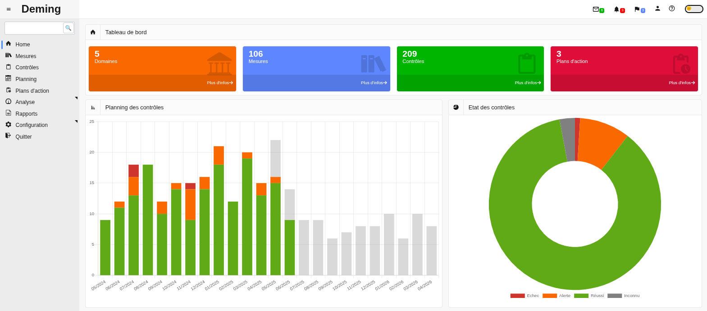
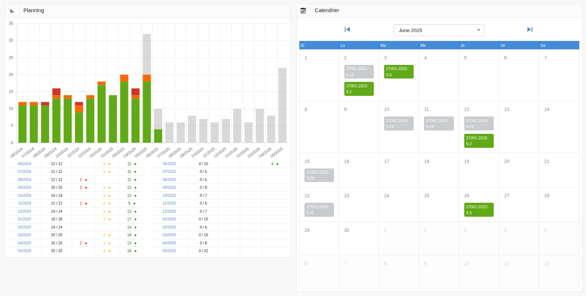

# Deming

## :rocket: Introduction

Dans un contexte où la sécurité de l'information est devenue un enjeu stratégique, les organisations doivent non seulement mettre en place des mesures de protection, mais aussi démontrer leur efficacité et leur cohérence dans le temps. Deming accompagne cette démarche en proposant une solution open source robuste, conçue pour piloter un système de management de la sécurité de l'information (SMSI) conforme à la norme ISO/IEC 27001.

Pensé par des RSSI pour des RSSI, Deming allie une couverture fonctionnelle complète, une architecture claire et une forte adaptabilité aux réalités du terrain. Adossé à une documentation soignée et à une communauté active, il s’impose progressivement comme une référence incontournable dans les environnements critiques.

Reconnu pour sa qualité et son impact, Deming est aujourd’hui le meilleur outil open source de GRC et de gestion du SMSI.

### :question: Qu’est-ce que Deming ?

**Deming** est un outil puissant et intuitif conçu pour la gestion, la planification, le suivi et le reporting de l’efficacité des mesures de sécurité. Conformément à la norme ISO/IEC 27001:2013, chapitre 9, **Deming** vous aide à garantir une sécurité adaptée et proportionnée, tout en respectant les standards les plus exigeants.

### :dart: Pourquoi contrôler ?

Le contrôle et l'évaluation réguliers des mesures de sécurité sont essentiels pour :

- Évaluer l'efficacité des contrôles mis en place.
- Vérifier que les exigences de sécurité sont respectées.
- Améliorer continuellement la sécurité de l’information.
- Fournir des données précises pour les prises de décision.
- Justifier les besoins d'amélioration du système de gestion de la sécurité de l'information (SMSI).

**Deming** vous offre les outils nécessaires pour répondre à ces objectifs avec efficacité.

### :chart_with_upwards_trend: Évaluation des performances

Selon la norme ISO 27001, chapitre 9.1, il est impératif d'évaluer les performances de sécurité. **Deming** vous guide à travers ce processus en vous permettant de :

- Déterminer ce qui doit être surveillé et mesuré.
- Choisir les méthodes adéquates pour assurer la validité des résultats.
- Planifier les moments de surveillance et de mesure.
- Identifier les responsables de chaque tâche.
- Analyser et évaluer les résultats obtenus.

## :computer: Aperçu des écrans

### :star: Écran principal

### :white_check_mark: Liste des contrôles

### :calendar: Planification des contrôles

### :memo: Gestion des plans d'action

### :satellite: Vue de la couverture des mesures de protection

### :page_facing_up: Rapport de réunion de pilotage du SMSI

## :classical_building: Référentiels supportés

| File                                 | Description                                                                    |
|--------------------------------------|--------------------------------------------------------------------------------|
| DORA.en.xlsx                         | [Digital Operational Resilience Act](https://www.esma.europa.eu/esmas-activities/digital-finance-and-innovation/digital-operational-resilience-act-dora)                                             |
| ISO27001-2013.fr.xlsx                | ISO/IEC 27001, 2013, in French                                                 |
| ISO27001-2022.en.xlsx                | [ISO/IEC 27001, 2022, in English](https://www.iso.org/standard/27001)          |
| ISO27001-2022.fr.xlsx                | [ISO/IEC 27001, 2022, in French](https://www.iso.org/fr/standard/27001)        |
| ISO27001-2023.de.xlsx                | [ISO/IEC 27001, 2023, in German](https://www.dinmedia.de/de/norm/din-en-iso-iec-27001/370680635) |
| MPA-5.2-Best-Practices.xlsx          | [Motion Picture Association Best Practices, v5.2](https://www.ttpn.org/wp-content/uploads/2023/08/MPA-Content-Security-Best-Practices-v5.2_Aug30_2023-Release.xlsx) |
| MPA-5.3-Best-Practices.xlsx          | [Motion Picture Association Best Practices, v5.3](https://www.ttpn.org/wp-content/uploads/2025/01/MPA-Content-Security-Best-Practices-v5.3_Jan6_2025_English.xlsx) |
| NIS2.en.xlsx                         | [NIS 2 directive requirements](https://eur-lex.europa.eu/legal-content/EN/TXT/?uri=CELEX%3A32022L2555) |
| NIS2.fr.xlsx                         | [NIS 2 directive requirements](https://eur-lex.europa.eu/legal-content/FR/TXT/?uri=CELEX%3A32022L2555) |
| MVSP-3.0.xlsx                        | [Minimum Viable Security Product, v3.0](https://mvsp.dev/mvsp.en/)             |
| PCI.DSS.4.0.EN.xlsx                  | [PCI DSS, v4.0, in English](https://blog.pcisecuritystandards.org/pci-dss-v4-0-resource-hub) |
| sp800-53r5-control-catalog-full.xlsx | [NIST SP 800-53 Rev. 5](https://csrc.nist.gov/pubs/sp/800/53/r5/upd1/final)    |

Ajouter votre propre référentiel dans cette liste se fait via une feuille de calcul dans [l'interface d'administration](https://dbarzin.github.io/deming/config.fr/#importation) de Deming.

## :books: Documentation

Pour en savoir plus sur l'utilisation de l'application, consultez la [documentation utilisateur](https://dbarzin.github.io/deming/index.fr/).

## :hammer_and_wrench: Technologies utilisées

- **Langages** : PHP, JavaScript
- **Framework** : Laravel
- **Base de données** : MariaDB, MySQL, PostgreSQL, and SQLite
- **Graphiques** : ChartJS

## ⚙️ Installation

Suivez la [procédure d'installation pour Ubuntu](https://github.com/dbarzin/deming/blob/main/INSTALL.fr.md) pour mettre en place l'application.

Suivez la [procédure d'installation pour Debian](https://github.com/dbarzin/deming/blob/main/INSTALL.debian.fr.md) pour mettre en place l'application.

## :car: Feuille de route

Consultez la [feuille de route](https://github.com/dbarzin/deming/blob/main/ROADMAP.md) pour découvrir les futures évolutions de **Deming**.

## :scroll: License

**Deming** est un logiciel open source distribué sous la licence [GPL](https://www.gnu.org/licenses/licenses.fr.html). Contribuez, améliorez, et participez à la sécurisation des systèmes d'information à l'échelle mondiale !
