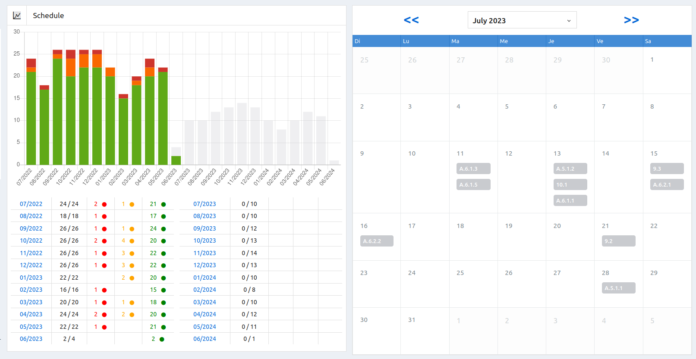
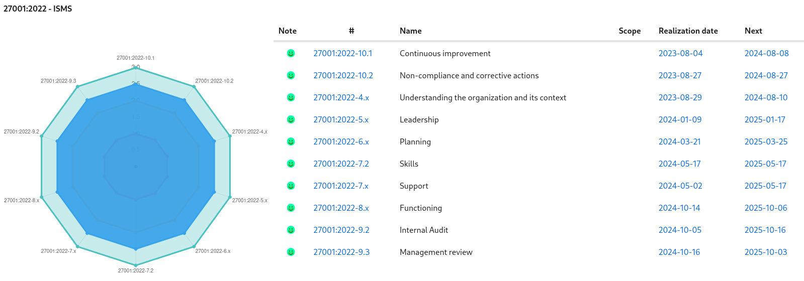
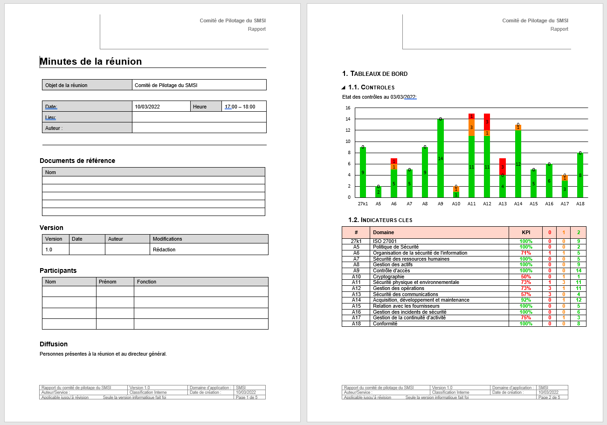
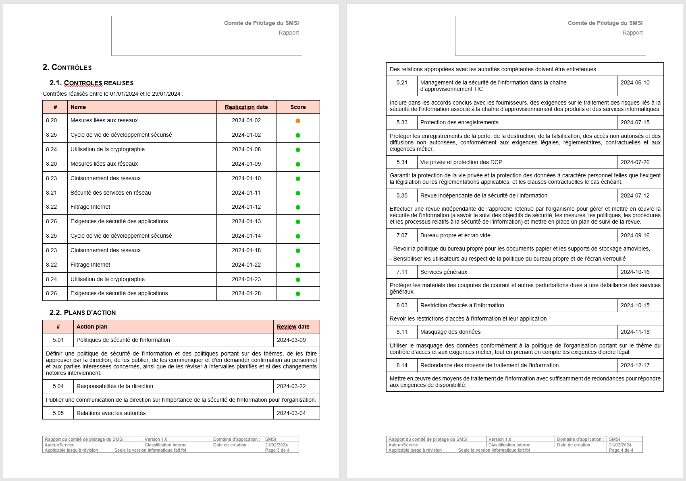

# Deming

Read this in other languages: [French](README.fr.md)

## Introduction

To manage the security of their information system, organizations must set up a
set of security measures and regularly check that these measures are effective and
efficient. These regular checks ensure that the security measures put in
place achieve their security objectives.

### What is Deming?

Deming is a tool for managing, planning, tracking and reporting the effectiveness of security controls.

This management of controls must allow the implementation of adequate and proportionate security. This approach is in line with the recommendations of ISO / IEC 27001:2013, chapter 9 which deals with performance evaluation.

### Why control?

The objectives of measuring the effectiveness of the requirements of an ISMS are:

a) assess the effectiveness of controls;

b) assess the effectiveness of the information management system;

c) to verify the extent to which the identified security requirements have been met;

d) facilitate the improvement of information security performance against objectives;

e) provide input for management review to facilitate ISMS-related decision-making;

f) to justify the needs for improvement of the ISMS.

### Evaluation of performances

The ISO 27001 standard in chapter 9.1 requires the evaluation of information security performance, as well as the effectiveness of the information security management system.

To assess this performance, it is necessary to determine:

a) what needs to be monitored and measured, including information security processes and measures;

b) the monitoring, measurement, analysis and evaluation methods, as applicable, to ensure the validity of the results;

c) when monitoring and measurements should be carried out;

d) who is to carry out the monitoring and measurements;

e) when the results of monitoring and measurements should be analyzed and evaluated; and

f) who should analyze and evaluate these results.

Deming helps meet these requirements and retain appropriate documented information as evidence of monitoring and measurement results.

## Definitions

**Control** : processes and policies you put in place to minimize information security risks.

**Measurement** : process of obtaining relative to the effectiveness of an ISMS and security measures, using an evaluation method, a function assessment, analytical model, and decision criteria [ISO/IEC 27004].

**Indicator**: result of the application of an analytical model to one or more variables in relation to the decision criteria or an information need [ISO/IEC 27004].

**Attribute**: property or characteristic of an object that can be quantitatively or qualitatively distinguished by human or automatic means [ISO/IEC 15939:2007].

## Screens

### Main Screen

### List of controls

### Control planning

### Action plan management

### View of the coverage of protective measures

### ISMS steering meeting report

## Technology
- PHP, JavaScript, Laravel
- Supported databases: MySQL, Postgres, SQLite, SQL Server
- ChartJS

## Documentation

The application has a [user documentation](https://dbarzin.github.io/deming/index).

## Facility

[Installation](https://github.com/dbarzin/deming/blob/main/INSTALL.md) procedure of the application.

## Roadmap

A [roadmap](https://github.com/dbarzin/deming/blob/main/ROADMAP.md) includes the planned changes to the application.

## License

Deming is open source software distributed under the [GPL](https://www.gnu.org/licenses/licenses.html) license.
