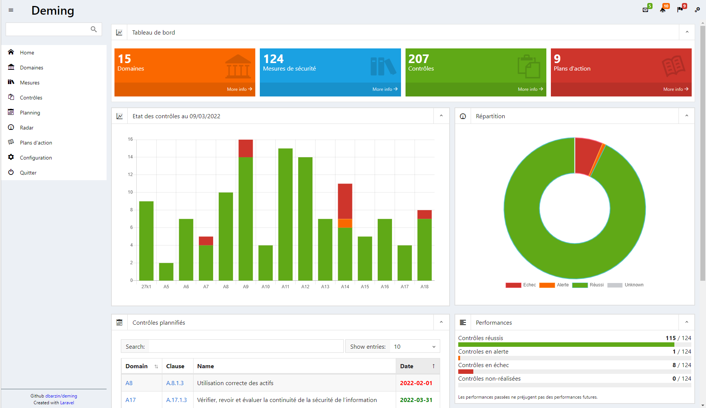
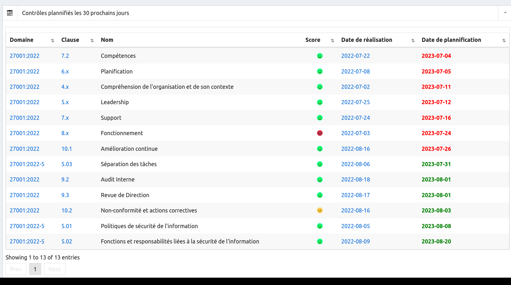
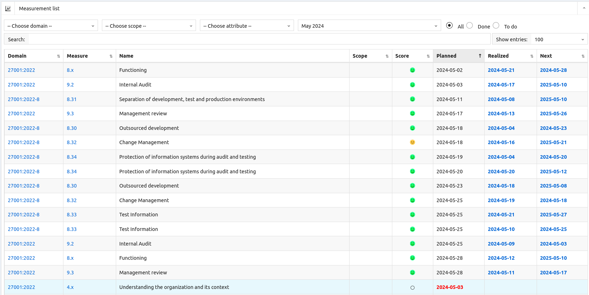
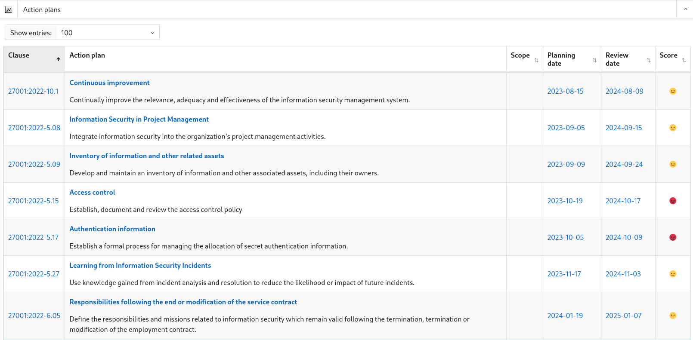
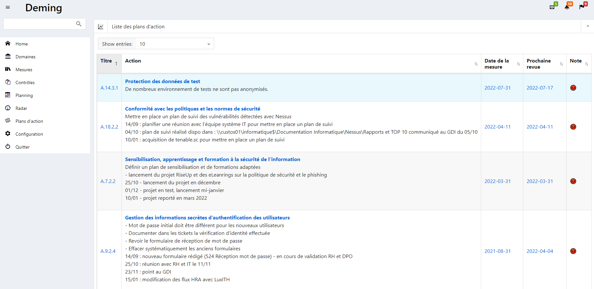

# Deming

Work in progress

## Introduction

Pour gérer la sécurité de leur système d’information les organisations doivent mettre en place un 
ensemble de mesures de sécurité et contrôler régulièrement que ces mesures sont effectives et 
efficaces. Ces contrôles réguliers permettent de garantir que les mesures de sécurités mises en 
place atteignent leurs objectifs de sécurité.

### Qu’est-ce que Deming ?

Deming est un outil qui permet de gérer, de planifier, de suivre et de rapporter l’efficafité de des contrôle de sécurité.

Cette gestion des contrôles doit permettre la mise en œuvre d’une sécurité adéquate et proportionnée. Cette approche est conforme aux recommandations de la norme ISO / IEC 27001:2013, chapitre 9 qui traite de l’évaluation des performances.

### Pourquoi contrôler ?

Les objectifs de mesure de l’efficacité des exigences d’un SMSI sont :

a) d’évaluer l'efficacité des contrôles;

b) d’évaluer l'efficacité du système de gestion de l'information;

c) de vérifier dans quelle mesure les exigences de sécurité identifiées ont été respectées;

d) de faciliter l’amélioration des performances de la sécurité de l’information par rapport aux objectifs ;

e) de fournir des données pour la revue de la direction afin de faciliter la prise de décision liée au SMSI ;

f) de justifier les besoins améliorations du ISMS.

### Evaluation des performances

La norme ISO 27001 au chapitre 9.1, impose d’évaluer les performances de sécurité de l’information, ainsi que l’efficacité du système de management de la sécurité de l’information.

Pour évaluer ces performances, il faut déterminer :

a) ce qu’il est nécessaire de surveiller et de mesurer, y compris les processus et les mesures de sécurité de l’information;

b) les méthodes de surveillance, de mesurage, d’analyse et d’évaluation, selon le cas, pour assurer la validité des résultats;

c) quand la surveillance et les mesures doivent être effectuées;

d) qui doit effectuer la surveillance et les mesures;

e) quand les résultats de la surveillance et des mesures doivent être analysés et évalués; et

f) qui doit analyser et évaluer ces résultats.

Deming permet de répondre à ces exigences et de conserver les informations documentées appropriées comme preuves des résultats de la surveillance et des mesures.

## Definitions

**Mesures de sécurité** (en anglais « Control ») : ensemble de dispositions à mettre en œuvre. Ce sont les mesures à prendre pour mettre en œuvre la politique de sécurité.

**Contrôle** ou Mesurage (en anglais « Measurement ») : processus d’obtention relative à l’efficacité d’un SMSI et de mesures de sécurité, à l’aide d’une méthode d’évaluation, d’une fonction d’évaluation, d’un modèle analytique, et de critère de décisions [ISO/IEC 27004].

**Indicateur** : résultat de l’application d’un modèle analytique à une ou plusieurs variables en relation avec les critères de décision ou d’un besoin d’information [ISO/IEC 27004].

**Attribut** : propriété ou caractéristique d’un objet qui peut être distingué quantitativement ou qualitativement par des moyens humains ou automatiques [ISO/IEC 15939:2007].

## Ecrans

### Ecran principal

### Liste des contrôles

### Planification des contrôles

### Gestion des plans d'action

## Technologies
- PHP, Javascript, Laravel
- Base de données supportées : MySQL, Postgres, SQLite, SQL Server
- ChartJS

## Installation

Procédure d'[installation](https://github.com/dbarzin/deming/blob/master/INSTALL.md) de l'application.

## Feuille de route

Une [feuille de route](https://github.com/dbarzin/deming/blob/master/ROADMAP.md) reprend les évolutions prévues de l'application.

## License

Deming est un logiciel open source distribué sous [GPL](https://www.gnu.org/licenses/licenses.fr.html).

