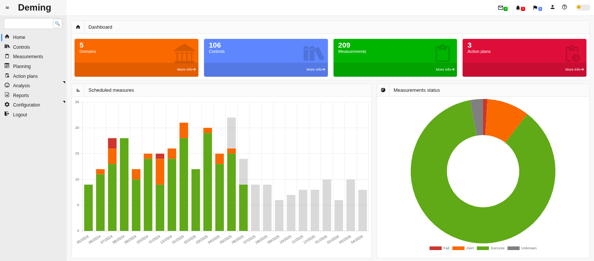
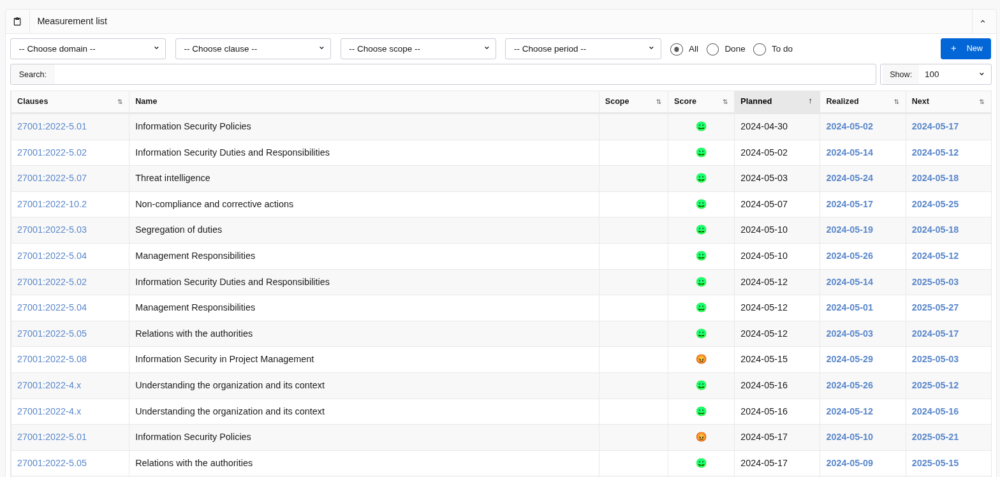
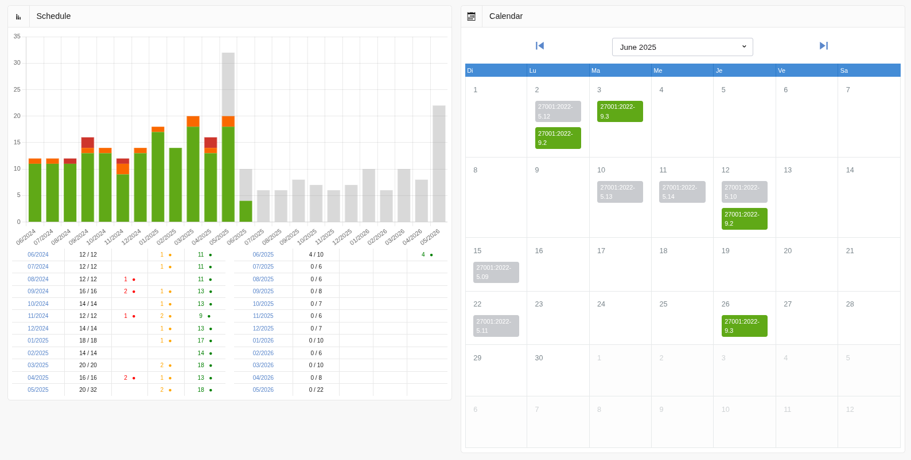
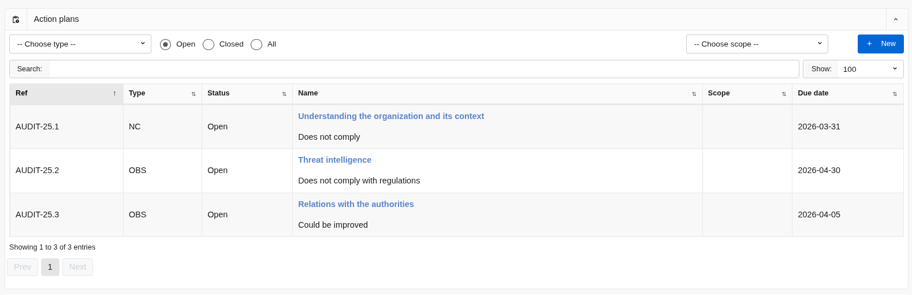
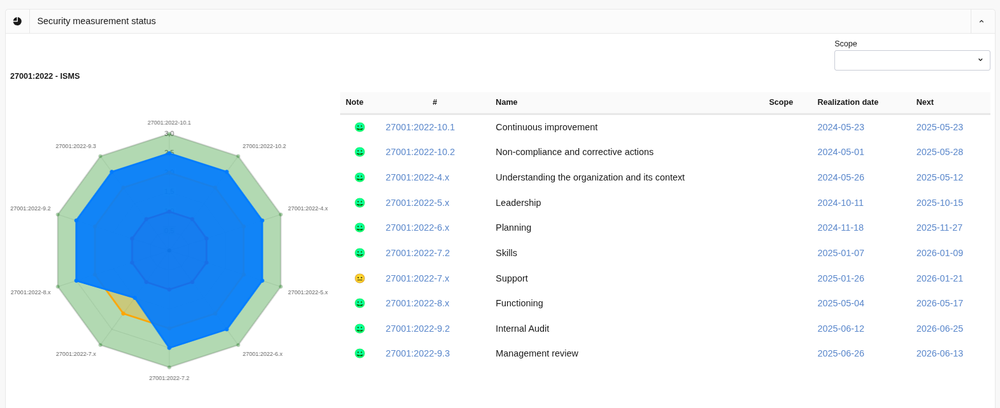

# Deming

[](https://github.com/dbarzin/deming/releases/latest)


- Read this in other languages: [French](README.fr.md)

## :rocket: Introduction

In a world where information security is more critical than ever, organizations must not only implement security measures, but also ensure that they are effective and efficient. **Deming** is here to help you meet this challenge head on.

### :question: What is Deming?

**Deming** is a powerful, intuitive tool designed for managing, planning, monitoring and reporting on the effectiveness of security measures. In line with ISO/IEC 27001:2013, Chapter 9, **Deming** helps you guarantee appropriate and proportionate security, while complying with the most demanding standards.

### :dart: Why monitor?

Regular monitoring and evaluation of security measures is essential for :

- Evaluate the effectiveness of controls in place.
- Verify that security requirements are being met.
- Continuously improve information security.
- Provide accurate data for decision-making.
- Justify the need to improve the information security management system (ISMS).

**Deming** gives you the tools you need to meet these objectives effectively.

### :chart_with_upwards_trend: Performance assessment

According to ISO 27001, chapter 9.1, it is imperative to assess security performance. **Deming** guides you through this process, enabling you to:

- Determine what needs to be monitored and measured.
- Choose the right methods to ensure valid results.
- Schedule monitoring and measurement times.
- Identify who is responsible for each task.
- Analyze and evaluate results.

## :computer: Screen overview

### :star: Main screen

[](public/screenshots/main1.en.png)

### :white_check_mark: List of controls

[](public/screenshots/controls.en.png)

### :calendar: Control planning

[](public/screenshots/calendar.en.png)

### :memo: Action plan management

[](public/screenshots/plans.en.png)

### :satellite: Protective measures coverage view

[](public/screenshots/radar.en.png)

### :page_facing_up:️ ISMS steering meeting report

[](public/screenshots/pilotage1.png)
[](public/screenshots/pilotage2.png)


## :classical_building: Referentials supproted

| File                                 | Description                                                                    |
|--------------------------------------|--------------------------------------------------------------------------------|
| DORA.en.xlsx                         | [Digital Operational Resilience Act](https://www.esma.europa.eu/esmas-activities/digital-finance-and-innovation/digital-operational-resilience-act-dora)                                             |
| ISO27001-2013.fr.xlsx                | ISO/IEC 27001, 2013, in French                                                 |
| ISO27001-2022.en.xlsx                | [ISO/IEC 27001, 2022, in English](https://www.iso.org/standard/27001)          |
| ISO27001-2022.fr.xlsx                | [ISO/IEC 27001, 2022, in French](https://www.iso.org/fr/standard/27001)        |
| ISO27001-2023.de.xlsx                | [ISO/IEC 27001, 2023, in German](https://www.dinmedia.de/de/norm/din-en-iso-iec-27001/370680635) |
| MPA-5.2-Best-Practices.xlsx          | [Motion Picture Association Best Practices, v5.2](https://www.ttpn.org/wp-content/uploads/2023/08/MPA-Content-Security-Best-Practices-v5.2_Aug30_2023-Release.xlsx) |
| MPA-5.3-Best-Practices.xlsx          | [Motion Picture Association Best Practices, v5.3](https://www.ttpn.org/wp-content/uploads/2025/01/MPA-Content-Security-Best-Practices-v5.3_Jan6_2025_English.xlsx) |
| NIS2.en.xlsx                         | [NIS 2 directive requirements](https://eur-lex.europa.eu/legal-content/EN/TXT/?uri=CELEX%3A32022L2555) |
| NIS2.fr.xlsx                         | [NIS 2 directive requirements](https://eur-lex.europa.eu/legal-content/FR/TXT/?uri=CELEX%3A32022L2555) |
| MVSP-3.0.xlsx                        | [Minimum Viable Security Product, v3.0](https://mvsp.dev/mvsp.en/)             |
| PCI.DSS.4.0.EN.xlsx                  | [PCI DSS, v4.0, in English](https://blog.pcisecuritystandards.org/pci-dss-v4-0-resource-hub) |
| sp800-53r5-control-catalog-full.xlsx | [NIST SP 800-53 Rev. 5](https://csrc.nist.gov/pubs/sp/800/53/r5/upd1/final)    |

Adding your own referential to this list is done via a spreadsheet in Deming's [administration interface](https://dbarzin.github.io/deming/config/#import).

## :books: Documentation

To find out more about using the application, please refer to the [user documentation](https://dbarzin.github.io/deming).

## :hammer_and_wrench:️ Technologies used

- **Languages**: PHP, JavaScript
- **Framework** : Laravel
- **Database**: MariaDB, MySQL, PostgreSQL, and SQLite
- **Graphics**: ChartJS

## ⚙️ Installation

Follow the [installation procedure for Debian](https://github.com/dbarzin/deming/blob/main/INSTALL.debian.md) to set up the application.

Follow the [installation procedure for Ubuntu](https://github.com/dbarzin/deming/blob/main/INSTALL.md) to set up the application.

### 🐳 Docker Installation

Get up and running quickly using Docker. Run a local instance in development mode:

```bash
git clone https://github.com/dbarzin/deming.git
cd deming
cp .env.example .env
sed -i 's/DB_HOST=127.0.0.1/DB_HOST=mysql/' .env
docker compose up
```

## :car: Roadmap

Consult the [roadmap](https://github.com/dbarzin/deming/blob/main/ROADMAP.md) to discover future developments of **Deming**.

## :scroll: License

**Deming** is open source software distributed under the [GPL](https://www.gnu.org/licenses/licenses.html) license. Contribute, improve and participate in securing information systems worldwide!
