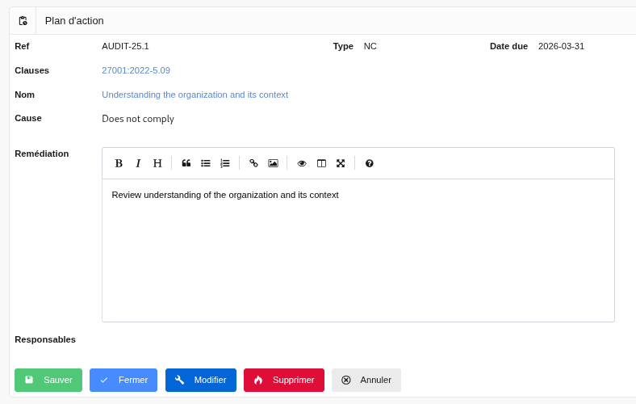

## Plans d'action

Chaque fois qu’un contrôle est en échec (orange ou rouge), un plan d’action doit être mis en place et suivi afin de remédier à la situation.

### Liste des plans d’action 

Cet écran permet de suivre les plans d’action :

[{: style="width:600px"}](images/a1.fr.png)

En cliquant sur :

* le titre du contrôle associé, vous arrivez vers la page de [modification du plan d’action](#edit) correspondant.

* La date de planification, vous arrivez sur le [contrôle](controls.fr.md/#show) ayant généré ce plan d’action

* La date de prochaine revue, vous arrivez vers le [contrôle](controls.fr.md/#show) suivant

### Modifier un plan d’action 

Cet écran permet de modifier un plan d’action et de planifier la prochaine évaluation du contrôle.

[{: style="width:600px"}](images/a2.fr.png)

Lorsque vous cliquez sur :

* « Sauver », vous sauver le plan d’action et revenez à la [liste des plans d’action](#list)

* « Annuler » vous revenez à la [liste des plans d’action](#list)
