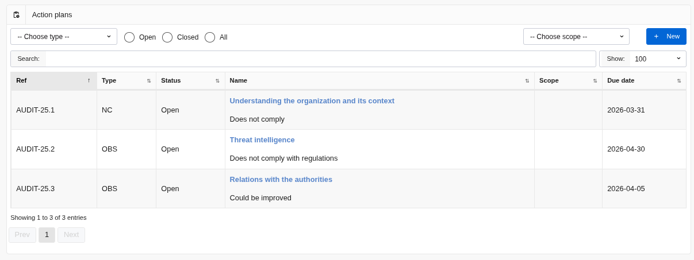
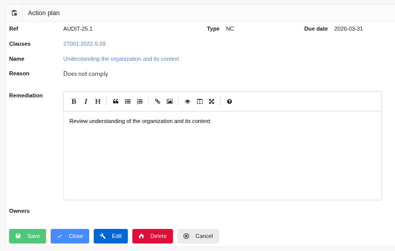

## Action Plans

Each time a control fails (orange or red), an action plan must be put in place and followed in order to remedy the situation.

### List of Action Plans 

This screen allows you to follow the action plans:

Clicking on :

* the title of the associated control, you arrive at the corresponding [modification of the action plan](#edit) page.

* On the planning date, you arrive at the [control](controls.md/#show) that generated this action plan

* The next review date, you arrive at the next [control](controls.md/#show)

### Edit an action plan 

This screen allows you to edit an action plan and schedule the next control assessment.

When you click:

* "Save", you save the action plan and return to the [list of action plans](#list)

* "Cancel" you return to the [list of action plans](#list)
