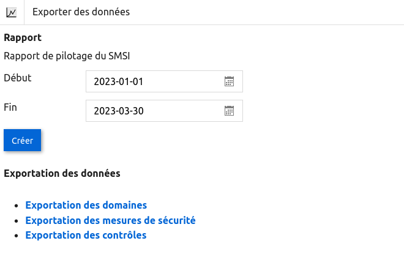
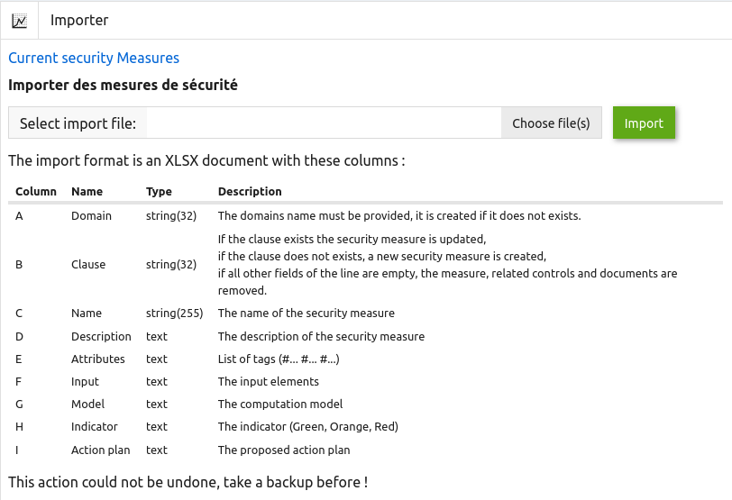
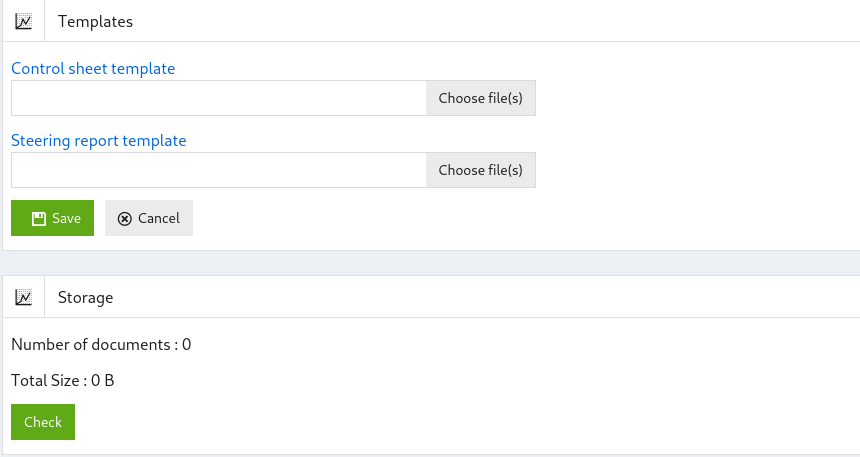

## Configuration

### Attributs 

Cet écran permet de gérer les attributs associés aux mesures de sécurité.
Il contient la liste des attributs et permet de créer, supprimer ou modifier des listes d’attributs.

### Domaines 

Cet écran permet de créer, modifier ou supprimer des listes de domaines de sécurité.

L’application est fournie avec une base de mesures de sécurité inspirée de la norme ISO 27001:2022, mais il est possible de définir de nouveaux domaines de sécurité inspirés d’autres normes comme PCI DSS, HDS...

### Utilisateurs 

Les utilisateurs sont définis dans l’application.

Il existe quatre rôles différents :

* RSSI : le RSSI est l'administrateur de l’application. Il peut créer de nouvelles mesures, de nouveaux attributs, modifier des contrôles déjà réalisés...

* Utilisateurs : les utilisateurs peuvent utiliser l’application sans pouvoir modifier les mesures, les attributs et les contrôles déjà réalisés.

* Audité : les audités ne peuvent réaliser et voir que les contrôles qui leur sont assignés ou qu'ils ont réalisés précédemment.

* Auditeur : l’auditeur a un accès en lecture à l’ensemble des informations de l’application.

### Rapports 

L’application permet de générer le rapport de pilotage du SMSI et d’exporter dans un fichier Excel la liste des domaines, les mesures de sécurités et tous les contrôles réalisés.

[{: style="width:500px"}](images/reports.png)

Voici le rapport de pilotage du SMSI :

[{: style="width:600px"}](images/report1.png)

[{: style="width:600px"}](images/report2.png)

### Importation 

Il est possible d'importer des mesures de sécurité depuis un fichier .XLSX ou depuis la base de données de modèles.

Lors de l'importation, il est possible de supprimer tous les autres contrôles et mesures et de générer des données de test.

[{: style="width:600px"}](images/import.png)

### Documents 

Cet écran permet de modifier les modèles de document utilisés pour les fiches de contrôle et le rapport de pilotage du SMSI et permet d’avoir une vue sur l’ensemble des documents utilisés comme preuve lors de la réalisation des contrôles de sécurité.

[{: style="width:400px"}](images/documents.png)

Le bouton « Vérifier » permet de vérifier l’intégrité des documents conservés dans l'application.

### Notifications 

Cet écran permet de configurer les notifications envoyées aux utilisateurs lorsqu'ils doivent réaliser des contrôles.

L'écran contient :

* Le sujet du mail envoyé à l'utilisateur;

* L'émetteur du mail;

* La périodicité de l'envoi des notifications;

* Le délais de notification.

[{: style="width:500px"}](images/config.fr.png)

Lorsque vous cliquer sur :

* "Sauver" - la configuration est sauvée;

* "Test" - un mail de test est envoyé à l'utilisateur courant ;

* "Cancel" - vous revenez à la page principale.
