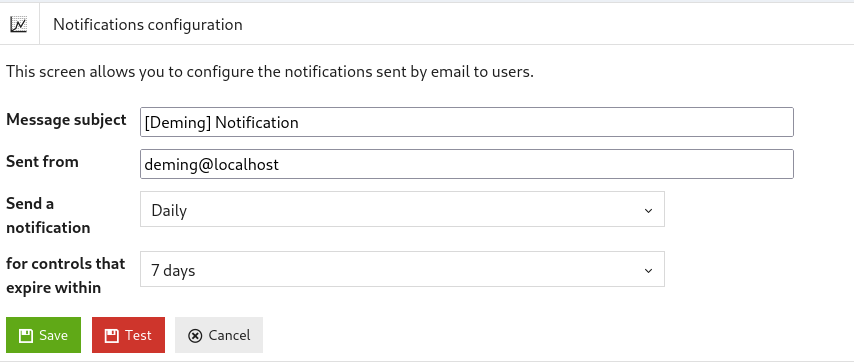

## Setup

### Attributes 

This screen allows you to manage the attributes associated with the security measures.
It contains the list of attributes and allows you to create, delete or modify attribute lists.

### Domains 

This screen allows you to create, modify or delete lists of security domains.

The application is provided with a security measurement base inspired by the ISO 27001:2022 standard, but it is possible to define new security domains inspired by other standards such as PCIDSS, HDS, etc.

### Users 

Users are directly defined in the application.

There are four different roles:

* RSSI: the RSSI is the administrator of the application. He can create new measurements, new attributes, modify controls already carried out...

* Users: users can use the application without being able to modify the measurements, attributes and controls already carried out.

* Auditee: Auditees can only carry out and see the mesurements that have been assigned to them or that they have carried out previously.

* Auditor: the auditor has read access to all the information in the application.

### Reports 

The application allows you to generate the ISMS management report and to export the list of domains, the security measures and all the checks carried out in an Excell file.

[{: style="width:500px"}](images/reports.png)

Here is the ISMS pilot report:

### Import 

It is possible to import controls from an .XLSX file.

### Documents 

This screen is used to modify the document templates used for the control sheets and the ISMS management report and provides an overview of all the documents used as evidence when carrying out security checks.

[{: style="width:400px"}](images/documents.png)

The "Verify" button allows you to verify the integrity of the documents stored in the application.

### Notifications 

This screen is used to configure the notifications sent to users when they have to carry out controls.

The screen contains:

* The subject of the mail sent to the user;

* The sender of the email;

* The periodicity of sending notifications;

* The notification deadlines.

[{: style="width:500px"}](images/config.png)

When you click on:

* "Save" - the configuration is saved;

* "Test" - a test mail is sent to the current user;

* "Cancel" - you return to the main page.
