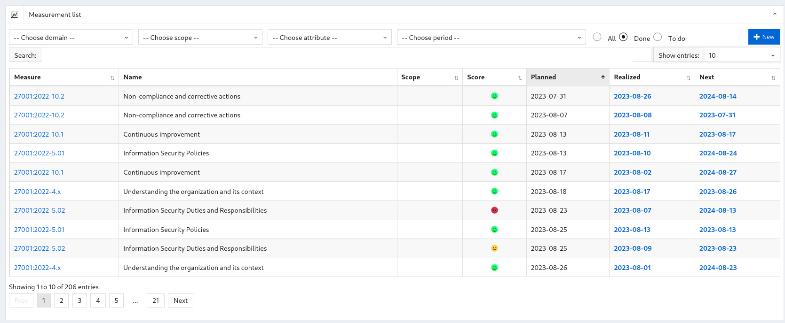
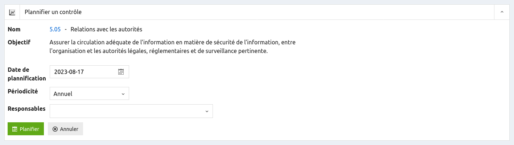
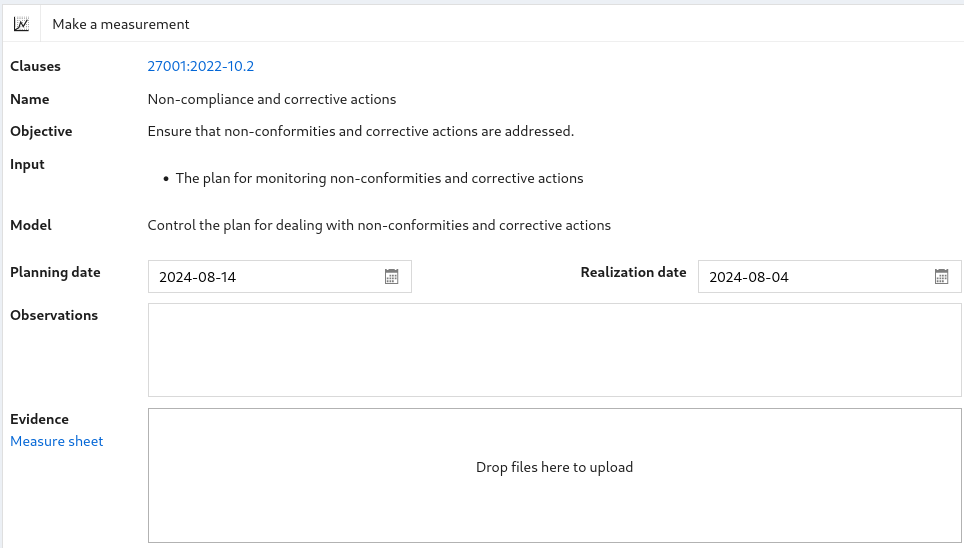
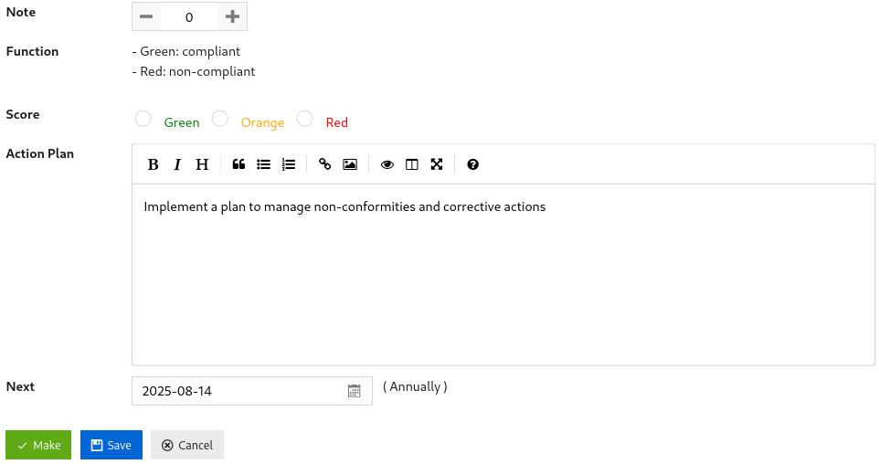

## Measurements

### List of measurements 

This screen is used to display the list of measurements and to filter them by:

* domain,

* périmètre,

* attribute,

* planning period,

* measurement status: all, done and to do,

When you click:

* The domain, you arrive at the [security domain display](config.md/#domains) screen

* Clause, you arrive at the [security measure display](measures.md/#show) screen.

* The date of completion, planning or the date of the next check, you arrive at the [security check display](#show) screen.

### Show a measurement 

This screen contains the information of a measurement:

* The name of a measurement;

* The objective of the measurement;

* Attributes ;

* Data;

* The model ;

* The dates of planning, completion and the date of the next inspection;

* The score assigned to the measurement; And

* The score attributed to the measurement (green, orange or red).

The "Make" and "Plan" buttons are present if this measurement has not yet been carried out.

The "Modify" and "Delete" buttons are available if the user is an administrator.

When you click:

* "Make", you are sent to the [measurement completion screen](#make)

* "Plan", you are sent to the [measurement planning screen](measures.md/#plan)

* "Edit", you are sent to the [measurement edit screen](#edit)

* "Delete", the measurement is deleted and you are sent to the [list of measurements](#list).

* "Cancel", you are sent to the [list of measurements](#list)

### Schedule a measurement

This screen is used to schedule a measurement.

This screen contains the information of a measurement:

* The name of a measurement;

* The objective of the measurement;

* The date of planification;

* Periodicity ; and

* Those responsible for carrying out the measurements.

[{: style="width:500px"}](images/c5.png)

When you click:

* "Plan", the planning date, the recurrence and the persons in charge are updated and you are returned to the [display screen of measurements](#show)

* "Unplan", remove the measurement and you are returned to the [List of measurements](#list)

* "Cancel", You are returned to the [measurement display screen](#show)

### Making a measurement  check

This screen allows you to perform a measurement.

This screen contains:

* The name of the measurement

* The goal

* Data

* Completion date, planning date

* A text area for observations

* A file area for saving evidence (**CTRL+V** can be used to paste a file or screenshot)

* A link to download the measurement sheet

* The computation model applied

* The note

* The score

* The action plan

* The date of the next check

When you click:

* "Make", the measurement is saved and a new measurement is created at the scheduled date

* "Save", the measurement is saved

and you return to the [list of measurements](#list).

### Measurement sheet 

The measurement sheet is a word document generated by the application based on the measurement data.

This form allows you to describe the observations made, to add screenshots or tables and to __electronically sign__ the observations.

The checklist can be [adapted](config.md/#documents) to match your organization's document model.
