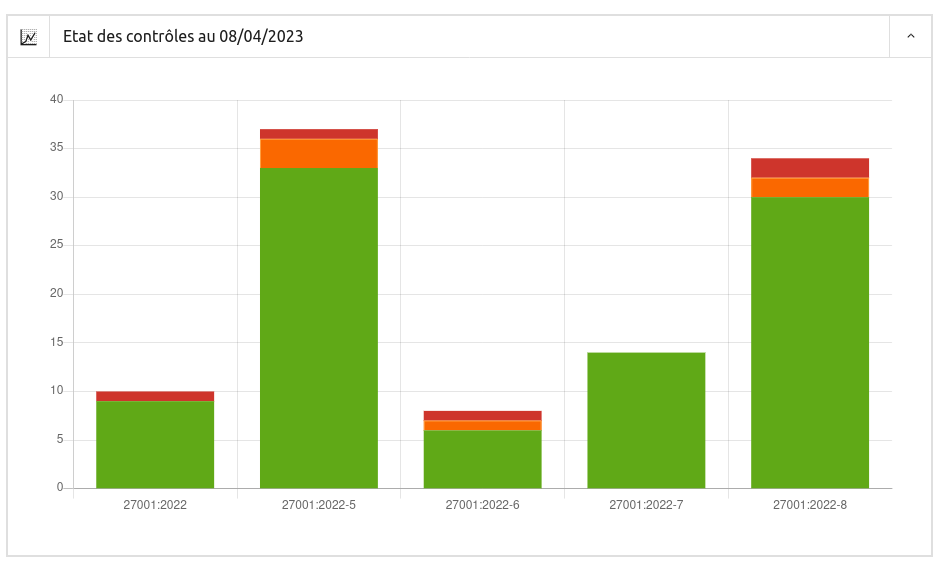
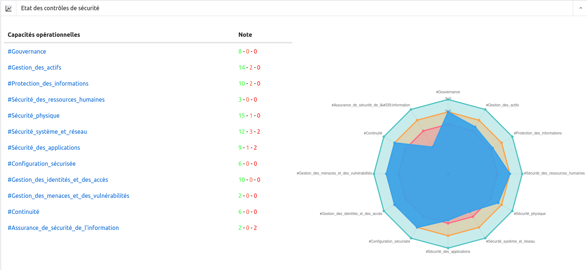

## Dashboards

There are three dashboards:

* controls by domains

* controls by domain and by measure

* controls by attribute

### Controls by domains

[{: style="width:500px"}](images/r1.png)

### Controls by domain and by measure

### Attribute checks

