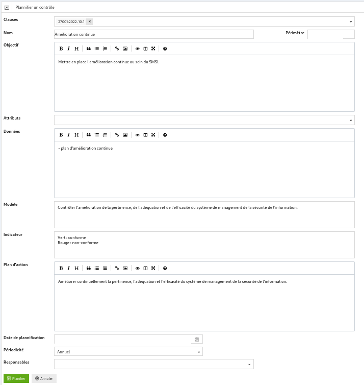

## Mesures de sécurité

Cette partie permet de définir, de modifier et de plannifier de nouvelles mesures de sécurité.

### Liste des mesures de sécurité 

La liste des mesures de sécurité permet d’afficher la liste des mesures, de les filtrer par domaine ou de recherche une mesure sur base d’une partie de son nom.

En cliquant sur :

* le domaine, vous arrivez sur la [définition du domaine choisi](config.fr.md/#domain)

* la clause, vous arrivez sur la [description de la mesure de sécurité](#show)

* le nombre de contrôle, vous arrivez sur la [liste des contrôles](controls.fr.md/#list) de cette mesure de sécurité

* le bouton "planifier", vous arrivez sur la [planification de la mesure de sécurité](#plan)

### Afficher une mesure de sécurité 

Cet écran permet d’afficher une mesure de sécurité.

Une mesure de sécurité est composée :

* d’un domaine ;

* d’un nom ;

* d’un objectif de sécurité ;

* d’attributs ;

* des données de mesures :

* du modèle de vérification ;

* d’un indicateur (vert, orange, rouge) ; et

* d’un plan d’action à appliquer si le contrôle de cette mesure de sécurité est en échec.

Lorsque vous cliquez sur :

* « Planifier » : vous arrivez vers l’écran de [planification de la mesure de sécurité](#plan).

* « Modifier » : vous arrivez vers [l’écran de moficiaton de la mesure](#edit)

* « Supprimer »: vous permet de supprimer la mesure et de revenir à [la liste des mesures de sécurité](#list)

* « Annuler » : vous renvoie vers la [liste des mesures de séucurité](#list)

### Modifier une mesure de sécurité 

Cet écran permet de modifier une mesure de sécurité.

Lorsque vous cliquez sur :

* « Sauver », les modifications sont sauvées et vous revenez à l’écran d’[affichage de la mesure de sécurité](#show).

* « Annluer », vous revenez à l’écran d’[affichage de la mesure de sécurité](#show).

### Planifier un contrôle 

Cet écran permet de planifier un contrôle de sécurité à partir d’une mesure.

L’écran contient :

* Le domaine ;

* Le nom de la mesure ;

* L’objectif de sécurité ;

* La date de planification ;

* La périodicité du contrôles et

* Les responsables de la réalisation du contrôles.

[{: style="width:600px"}](images/plan.fr.png)

Lorsque vous cliquez sur :

* « Planifier »,

    * s’il n’existe pas de contrôle avec ce périmètre pour cette mesure, un nouveau contrôle est créé en copiant toutes les données de le mesure et est planifié à la date spécifiée.

    * S’il existe déjà un contrôle avec ce périmètre pour cette mesure de sécurité, une erreur est affichée.

	Vous revenez ensuite à la [liste des mesures de sécurité](#list).

* « Annuler », vous revenez vers la [liste des mesures de sécurité](#list).
