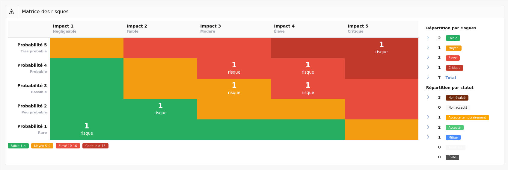
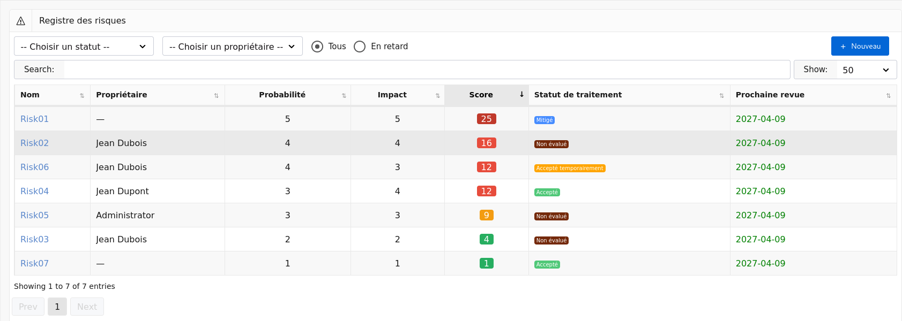
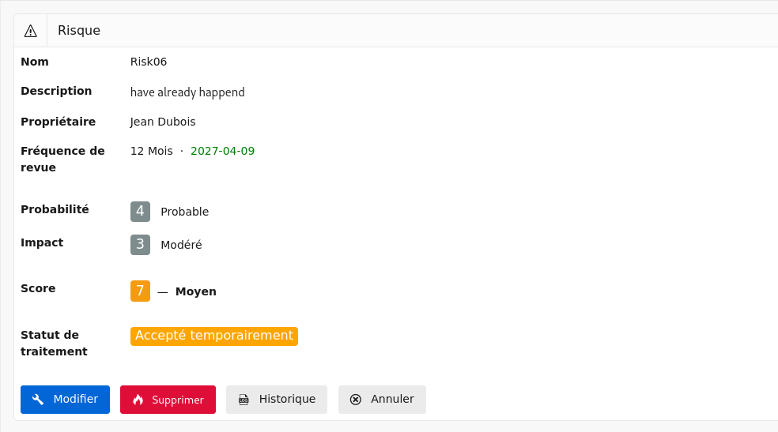
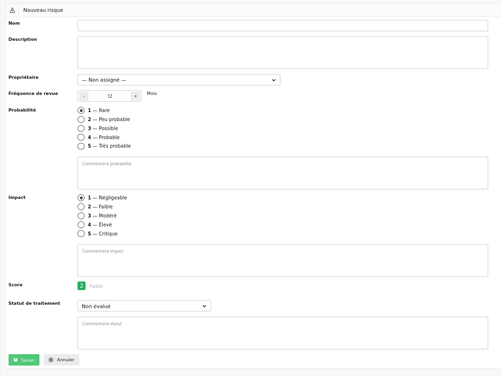
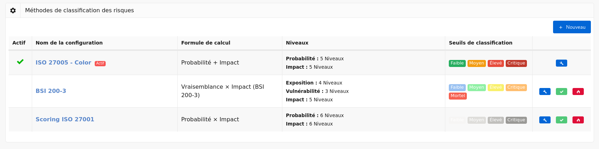
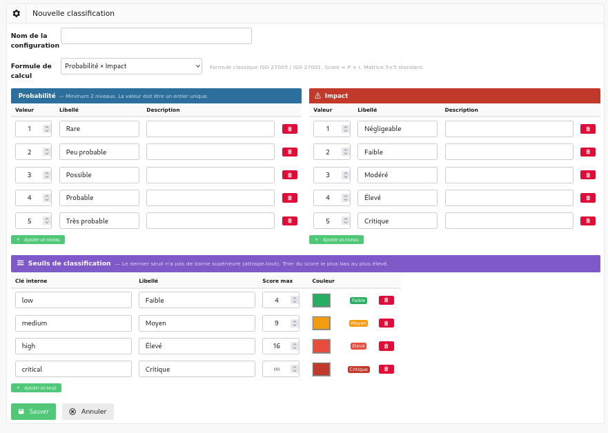

# Registre des risques

Le registre des risques permet de gérer les risques de sécurité de l'information conformément aux exigences de la norme ISO 27001:2022, notamment :

- **§ 6.1.2** — Processus d'appréciation des risques de sécurité de l'information
- **§ 6.1.3** — Processus de traitement des risques de sécurité de l'information
- **§ 8.2** — Appréciation des risques de sécurité de l'information

Chaque risque est évalué selon une méthode de scoring configurable, lié aux [contrôles](controls.fr.md) et [plans d'action](actions.fr.md) existants de l'application, et soumis à un cycle de revue périodique.

## Matrice des risques {#matrix}

Cet écran affiche une vue synthétique de l'ensemble des risques sous forme de matrice.

La matrice croise les axes de probabilité (ou de vraisemblance) et d'impact. Chaque cellule est colorée selon le niveau de risque correspondant et affiche le nombre de risques positionnés dans cette cellule. En cliquant sur une cellule non vide, vous accédez à la [liste des risques](#list) filtrée sur ce score.

> Les axes de la matrice et les couleurs des cellules s'adaptent automatiquement à la [méthode de scoring active](#scoring).

La partie latérale de l'écran résument la situation :

À droite de la matrice, un tableau présente le **nombre de risques par niveau** et la **répartition des risques par statut de traitement**, avec pour chaque élément un lien direct vers la liste des risques filtrée sur le crit!re sélectionné.

## Liste des risques {#list}

Cet écran affiche l'ensemble des risques enregistrés.

La liste peut être filtrée par :

- **Statut de traitement** — Non évalué, Non accepté, Accepté, Mitigé, etc.
- **Propriétaire** — la personne responsable de la revue du risque.
- **En retard** — affiche uniquement les risques dont la date de prochaine revue est dépassée.

> Les utilisateurs avec le rôle **Audité** ne voient que les risques dont ils sont propriétaires.

Pour chaque risque, la liste affiche :

- Le nom du risque ;
- Le propriétaire ;
- La probabilité et l'impact ;
- Le **score calculé**, avec un badge coloré selon le niveau de risque (Faible, Moyen, Élevé, Critique) ;
- Le statut de traitement ;
- La date de prochaine revue, en rouge si dépassée.

Les boutons  **Nouveau** en haut à droite permettent de créer un nouveau risque.

## Afficher un risque {#show}

Cet écran affiche le détail d'un risque.

[{: style="width:600px"}](images/risk.show.fr.png)

Il contient :

- Le **nom** et la **description** du risque ;
- Le **propriétaire** et la fréquence de revue avec la date de prochaine revue ;
- L'évaluation :
    - La **probabilité** avec son libellé et son commentaire (formules standard) ;
    - L'**exposition** et la **vulnérabilité** avec la vraisemblance calculée (formule BSI 200-3) ;
    - L'**impact** avec son libellé et son commentaire ;
    - Le **score** calculé et le **niveau de risque** ;
- Le traitement :
    - Le **statut de traitement** avec son commentaire ;
    - Les **contrôles liés** (si statut = Mitigé) ;
    - Les **plans d'action liés** (si statut = Non accepté) ;

Les boutons disponibles dépendent du rôle de l'utilisateur :

- **Modifier** — accède à l'[écran de modification](#edit) (Administrateur et Utilisateur) ;
- **Supprimer** — supprime le risque après confirmation (Administrateur uniquement) ;
- **Historique** — affiche le journal des modifications (Administrateur uniquement) ;
- **Annuler** — revient à la [liste des risques](#list).

## Créer un risque {#create}

Cet écran permet de créer un nouveau risque.

Il contient les champs suivants :

- **Nom** *(obligatoire)* — intitulé court et identifiable du risque ;
- **Description** — description détaillée du risque ;
- **Propriétaire** — utilisateur responsable de la revue périodique du risque ;
- **Fréquence de revue** — intervalle en mois entre deux revues. La date de prochaine revue est calculée automatiquement si elle n'est pas saisie manuellement.

L'évaluation du risque dépend de la [méthode de scoring active](#scoring) :

- Pour les formules standard (Probabilité × Impact, Probabilité + Impact, max) :
    - **Probabilité** — niveau de 1 à N avec libellé et description ;
    - **Commentaire probabilité** ;
- Pour la formule BSI 200-3 (Vraisemblance × Impact) :
    - **Exposition** — accessibilité du système (ex. 0 = hors réseau, 1 = interne, 2 = Internet) ;
    - **Vulnérabilité** — niveau d'exploitabilité des failles connues ;
- **Impact** — gravité des conséquences si le risque se matérialise ;
- **Commentaire impact** ;
- **Score calculé** — mis à jour en temps réel selon les valeurs saisies, avec badge coloré indiquant le niveau.

Le traitement du risque se configure via :

- **Statut** — parmi : Non évalué, Non accepté, Accepté temporairement, Accepté, Mitigé, Transféré, Évité ;
- **Commentaire statut** ;
- **Contrôles liés** — sélection multiple parmi les contrôles existants (affiché uniquement si statut = *Mitigé*) ;
- **Plans d'action liés** — sélection multiple parmi les plans d'action existants (affiché uniquement si statut = *Non accepté*).

> Un avertissement est affiché si un risque *Mitigé* est sauvegardé sans contrôle lié, ou si un risque *Non accepté* est sauvegardé sans plan d'action lié.

Lorsque vous cliquez sur :

- **Sauver** — le risque est créé et vous êtes renvoyé vers l'[affichage du risque](#show) ;
- **Annuler** — vous revenez à la [liste des risques](#list).

## Modifier un risque {#edit}

Cet écran permet de modifier un risque existant. Il contient les mêmes champs que l'[écran de création](#create), avec en plus :

- La **date de prochaine revue** modifiable manuellement ;
- Le score actuel pré-rempli, recalculé dynamiquement à chaque modification.

Lorsque la fréquence de revue est modifiée et qu'aucune date de prochaine revue n'est saisie, celle-ci est recalculée automatiquement à partir de la date du jour.

Lorsque vous cliquez sur :

- **Sauver** — le risque est mis à jour et vous êtes renvoyé vers l'[affichage du risque](#show) ;
- **Annuler** — vous revenez à l'[affichage du risque](#show) sans modification.

## Configuration du scoring {#scoring}

Le scoring des risques est entièrement configurable. Plusieurs configurations peuvent être définies, mais une seule est active à la fois. Le changement de configuration active s'applique immédiatement à l'ensemble du registre.

### Liste des configurations {#scoring-list}

Cet écran affiche l'ensemble des configurations de scoring définies dans l'application.

Pour chaque configuration, la liste affiche :

- Un indicateur de configuration **active** ;
- Le **nom** de la configuration ;
- La **formule** utilisée ;
- Le détail des **niveaux** configurés (probabilité ou exposition/vulnérabilité, impact) ;
- Les **seuils de classification** sous forme de badges colorés avec leur plage de score en info-bulle.

Les boutons d'action disponibles pour chaque ligne sont :

- **Modifier** (crayon) — accède à l'[écran de modification de la configuration](#scoring-edit) ;
- **Activer** (coche) — active cette configuration après confirmation. L'ancienne configuration active est automatiquement désactivée. Bouton absent si la configuration est déjà active ;
- **Supprimer** (flamme) — supprime la configuration après confirmation. Impossible de supprimer la configuration active.

Le bouton **Nouveau** en haut à droite permet de créer une nouvelle configuration.

### Créer ou modifier une configuration {#scoring-edit}

Cet écran permet de définir une méthode de scoring complète.

#### Nom et formule

- **Nom** — libellé de la configuration, affiché dans la liste ;
- **Formule** — la méthode de calcul du score. Quatre formules sont disponibles :

| Formule | Calcul | Usage recommandé |
|---|---|---|
| Probabilité × Impact | Score = P × I | ISO 27005 / ISO 27001 classique |
| Vraisemblance × Impact | Score = (Exposition + Vulnérabilité) × I | BSI 200-3 / ISACA CSC-IT |
| Probabilité + Impact | Score = P + I | Triage rapide |
| max(Probabilité, Impact) | Score = max(P, I) | Approche conservatrice |

> La sélection de la formule *Vraisemblance × Impact* affiche les sections **Exposition** et **Vulnérabilité** à la place de la section **Probabilité**.

#### Niveaux

Chaque axe d'évaluation dispose d'un tableau de niveaux personnalisables. Chaque niveau est défini par :

- **Valeur** — entier unique utilisé dans le calcul du score ;
- **Libellé** — nom court affiché dans le formulaire de risque ;
- **Description** — texte explicatif pour guider les utilisateurs lors de l'évaluation.

Le bouton **Ajouter un niveau** permet d'insérer une ligne supplémentaire. Le bouton de suppression (corbeille) retire la ligne. Un minimum de deux niveaux est requis par axe.

Les axes configurables sont :

- **Probabilité** — présent pour les formules standard ;
- **Exposition** — présent pour la formule BSI (0 = hors réseau, 1 = réseau interne, 2 = exposé Internet) ;
- **Vulnérabilité** — présent pour la formule BSI (1 = aucune connue, 2 = connue non exploitable, 3 = exploitable en interne, 4 = exploitable à distance) ;
- **Impact** — présent pour toutes les formules.

#### Seuils de classification

Les seuils définissent la correspondance entre un score numérique et un niveau de risque qualifié. Chaque seuil comprend :

- **Clé interne** — identifiant technique (ex. `low`, `medium`, `high`, `critical`) ;
- **Libellé** — nom affiché dans les badges et les rapports ;
- **Score max** — borne supérieure du seuil. Le dernier seuil n'a pas de borne supérieure (attrape-tout) ;
- **Couleur** — couleur du badge MetroUI : Vert, Orange, Rouge, Rouge foncé, Bleu, Gris.

La colonne **Aperçu** affiche un badge en temps réel reflétant la couleur et le libellé saisis.

> Trier les seuils du score le plus bas au plus élevé. Le dernier seuil doit toujours avoir le champ Score max vide.

Lorsque vous cliquez sur :

- **Sauver** — la configuration est enregistrée (inactive par défaut à la création) et vous revenez à la [liste des configurations](#scoring-list) ;
- **Annuler** — vous revenez à la [liste des configurations](#scoring-list) sans modification.

---

## Intégration avec les autres modules

Le registre des risques s'intègre avec les modules existants de Deming :

- **Contrôles** — un risque avec le statut *Mitigé* peut être lié à un ou plusieurs contrôles de sécurité. Le lien est bidirectionnel : la page de détail du risque liste les contrôles associés et permet d'y accéder directement.

- **Plans d'action** — un risque avec le statut *Non accepté* doit être associé à un ou plusieurs plans d'action. La page de détail du risque liste les plans d'action associés et permet d'y accéder directement.

- **Planning** — la date de prochaine revue de chaque risque est gérée indépendamment du planning des contrôles, mais peut être alignée manuellement selon les cycles de revue de votre SMSI.

- **Rôles** — les restrictions d'accès suivent le même modèle que le reste de l'application :

| Rôle | Accès |
|---|---|
| Administrateur | Lecture, création, modification, suppression, configuration du scoring |
| Utilisateur | Lecture, création, modification |
| Auditeur | Lecture seule (tous les risques) |
| Audité | Lecture et modification des risques dont il est propriétaire uniquement |
