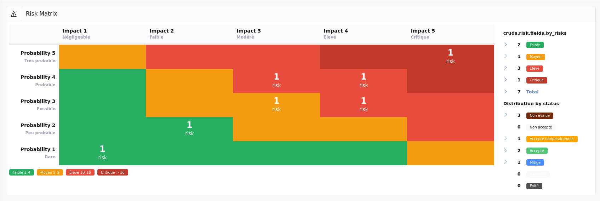
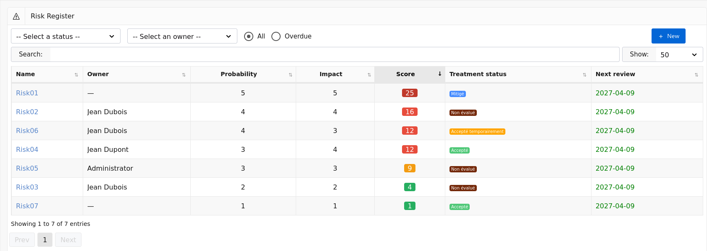
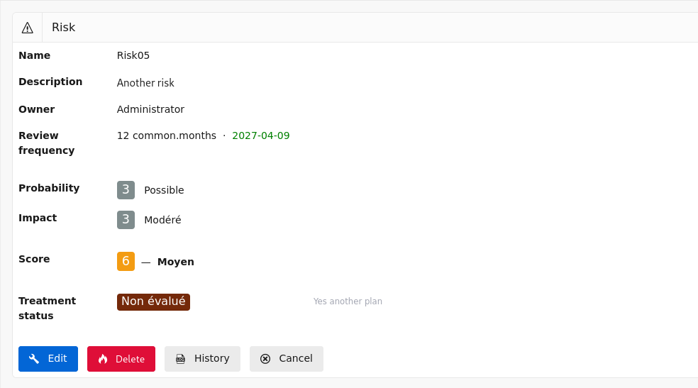
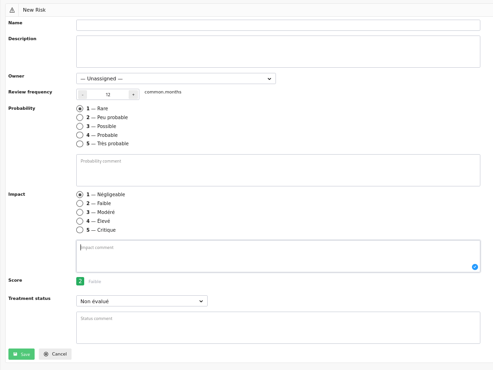
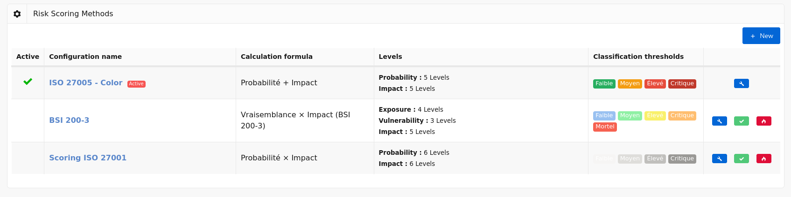
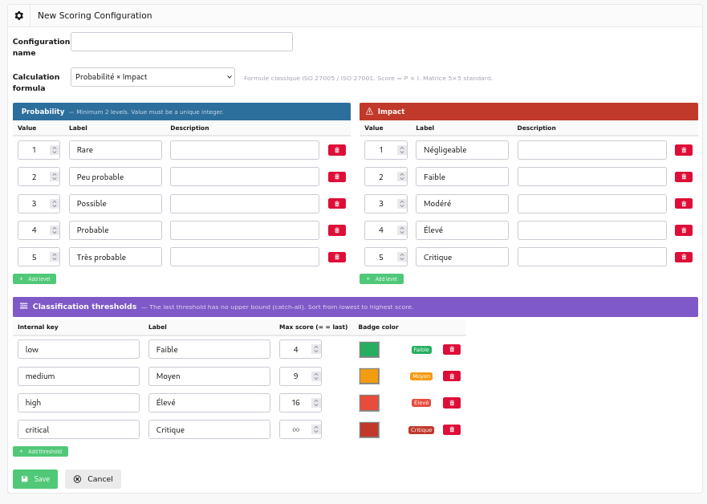

# Risk Register

The risk register allows you to manage information security risks in accordance with the requirements of ISO 27001:2022, specifically:

- **§ 6.1.2** — Information security risk assessment process
- **§ 6.1.3** — Information security risk treatment process
- **§ 8.2** — Information security risk assessment

Each risk is evaluated using a configurable scoring method, linked to the application's existing [controls](controls.md) and [action plans](actions.md), and subject to a periodic review cycle.

## Risk Matrix {#matrix}

This screen displays a summary view of all risks in matrix form.

The matrix crosses the probability (or likelihood) and impact axes. Each cell is color-coded according to the corresponding risk level and displays the number of risks positioned in that cell. Clicking on a non-empty cell takes you to the [risk list](#list) filtered on that score.

> The matrix axes and cell colors automatically adapt to the [active scoring method](#scoring).

The side panel summarises the situation:

To the right of the matrix, a table shows the **number of risks per level** and the **distribution of risks by treatment status**, each with a direct link to the risk list filtered on the selected criterion.

## Risk List {#list}

This screen displays all recorded risks.

The list can be filtered by:

- **Treatment status** — Unassessed, Not accepted, Accepted, Mitigated, etc.
- **Owner** — the person responsible for reviewing the risk.
- **Overdue** — displays only risks whose next review date has passed.

> Users with the **Auditee** role only see risks they own.

For each risk, the list displays:

- The risk name;
- The owner;
- The probability and impact;
- The **calculated score**, with a color-coded badge indicating the risk level (Low, Medium, High, Critical);
- The treatment status;
- The next review date, shown in red if overdue.

The **New** button in the top right allows you to create a new risk.

## View a Risk {#show}

This screen displays the detail of a risk.

[{: style="width:600px"}](images/risk.show.png)

It contains:

- The risk **name** and **description**;
- The **owner** and review frequency with the next review date;
- The assessment:
    - **Probability** with its label and comment (standard formulas);
    - **Exposure** and **vulnerability** with the calculated likelihood (BSI 200-3 formula);
    - **Impact** with its label and comment;
    - The calculated **score** and the **risk level**;
- The treatment:
    - The **treatment status** with its comment;
    - **Linked controls** (if status = Mitigated);
    - **Linked action plans** (if status = Not accepted);

The available buttons depend on the user's role:

- **Edit** — accesses the [edit screen](#edit) (Administrator and User);
- **Delete** — deletes the risk after confirmation (Administrator only);
- **History** — displays the change log (Administrator only);
- **Cancel** — returns to the [risk list](#list).

## Create a Risk {#create}

This screen allows you to create a new risk.

It contains the following fields:

- **Name** *(required)* — short, identifiable label for the risk;
- **Description** — detailed description of the risk;
- **Owner** — user responsible for the periodic review of the risk;
- **Review frequency** — interval in months between two reviews. The next review date is calculated automatically if not entered manually.

The risk assessment depends on the [active scoring method](#scoring):

- For standard formulas (Probability × Impact, Probability + Impact, max):
    - **Probability** — level from 1 to N with label and description;
    - **Probability comment**;
- For the BSI 200-3 formula (Likelihood × Impact):
    - **Exposure** — system accessibility (e.g. 0 = off-network, 1 = internal, 2 = Internet);
    - **Vulnerability** — level of exploitability of known weaknesses;
- **Impact** — severity of consequences if the risk materialises;
- **Impact comment**;
- **Calculated score** — updated in real time based on the entered values, with a color-coded badge indicating the level.

Risk treatment is configured via:

- **Status** — one of: Unassessed, Not accepted, Temporarily accepted, Accepted, Mitigated, Transferred, Avoided;
- **Status comment**;
- **Linked controls** — multiple selection from existing controls (displayed only if status = *Mitigated*);
- **Linked action plans** — multiple selection from existing action plans (displayed only if status = *Not accepted*).

> A warning is displayed if a *Mitigated* risk is saved without a linked control, or if a *Not accepted* risk is saved without a linked action plan.

When you click:

- **Save** — the risk is created and you are redirected to the [risk view](#show);
- **Cancel** — you return to the [risk list](#list).

## Edit a Risk {#edit}

This screen allows you to modify an existing risk. It contains the same fields as the [create screen](#create), with the addition of:

- The **next review date**, editable manually;
- The current score pre-filled, dynamically recalculated with each change.

When the review frequency is changed and no next review date is entered, it is automatically recalculated from today's date.

When you click:

- **Save** — the risk is updated and you are redirected to the [risk view](#show);
- **Cancel** — you return to the [risk view](#show) without changes.

## Scoring Configuration {#scoring}

Risk scoring is fully configurable. Multiple configurations can be defined, but only one is active at a time. Changing the active configuration takes effect immediately across the entire register.

### Configuration List {#scoring-list}

This screen displays all scoring configurations defined in the application.

For each configuration, the list displays:

- An **active** configuration indicator;
- The configuration **name**;
- The **formula** used;
- The detail of the configured **levels** (probability or exposure/vulnerability, impact);
- The **classification thresholds** as color-coded badges with their score range shown in a tooltip.

The available action buttons for each row are:

- **Edit** (pencil) — accesses the [configuration edit screen](#scoring-edit);
- **Activate** (checkmark) — activates this configuration after confirmation. The previously active configuration is automatically deactivated. Button absent if the configuration is already active;
- **Delete** (flame) — deletes the configuration after confirmation. The active configuration cannot be deleted.

The **New** button in the top right allows you to create a new configuration.

### Create or Edit a Configuration {#scoring-edit}

This screen allows you to define a complete scoring method.

#### Name and Formula

- **Name** — label for the configuration, displayed in the list;
- **Formula** — the score calculation method. Four formulas are available:

| Formula | Calculation | Recommended use |
|---|---|---|
| Probability × Impact | Score = P × I | Classic ISO 27005 / ISO 27001 |
| Likelihood × Impact | Score = (Exposure + Vulnerability) × I | BSI 200-3 / ISACA CSC-IT |
| Probability + Impact | Score = P + I | Quick triage |
| max(Probability, Impact) | Score = max(P, I) | Conservative approach |

> Selecting the *Likelihood × Impact* formula displays the **Exposure** and **Vulnerability** sections in place of the **Probability** section.

#### Levels

Each assessment axis has a table of customisable levels. Each level is defined by:

- **Value** — unique integer used in the score calculation;
- **Label** — short name displayed in the risk form;
- **Description** — explanatory text to guide users during assessment.

The **Add level** button inserts an additional row. The delete button (trash icon) removes the row. A minimum of two levels is required per axis.

The configurable axes are:

- **Probability** — present for standard formulas;
- **Exposure** — present for the BSI formula (0 = off-network, 1 = internal network, 2 = Internet-facing);
- **Vulnerability** — present for the BSI formula (1 = none known, 2 = known but not exploitable, 3 = exploitable internally, 4 = remotely exploitable);
- **Impact** — present for all formulas.

#### Classification Thresholds

Thresholds define the mapping between a numerical score and a qualified risk level. Each threshold includes:

- **Internal key** — technical identifier (e.g. `low`, `medium`, `high`, `critical`);
- **Label** — name displayed in badges and reports;
- **Max score** — upper bound of the threshold. The last threshold has no upper bound (catch-all);
- **Color** — MetroUI badge color: Green, Orange, Red, Dark Red, Blue, Grey.

The **Preview** column displays a live badge reflecting the entered color and label.

> Sort thresholds from the lowest to the highest score. The last threshold must always have the Max score field left empty.

When you click:

- **Save** — the configuration is saved (inactive by default on creation) and you return to the [configuration list](#scoring-list);
- **Cancel** — you return to the [configuration list](#scoring-list) without changes.

---

## Integration with Other Modules

The risk register integrates with Deming's existing modules:

- **Controls** — a risk with *Mitigated* status can be linked to one or more security controls. The link is bidirectional: the risk detail page lists the associated controls and allows direct navigation to them.

- **Action plans** — a risk with *Not accepted* status must be associated with one or more action plans. The risk detail page lists the associated action plans and allows direct navigation to them.

- **Planning** — the next review date of each risk is managed independently of the control planning schedule, but can be manually aligned with your ISMS review cycles.

- **Roles** — access restrictions follow the same model as the rest of the application:

| Role | Access |
|---|---|
| Administrator | Read, create, edit, delete, scoring configuration |
| User | Read, create, edit |
| Auditor | Read-only (all risks) |
| Auditee | Read and edit risks they own only |